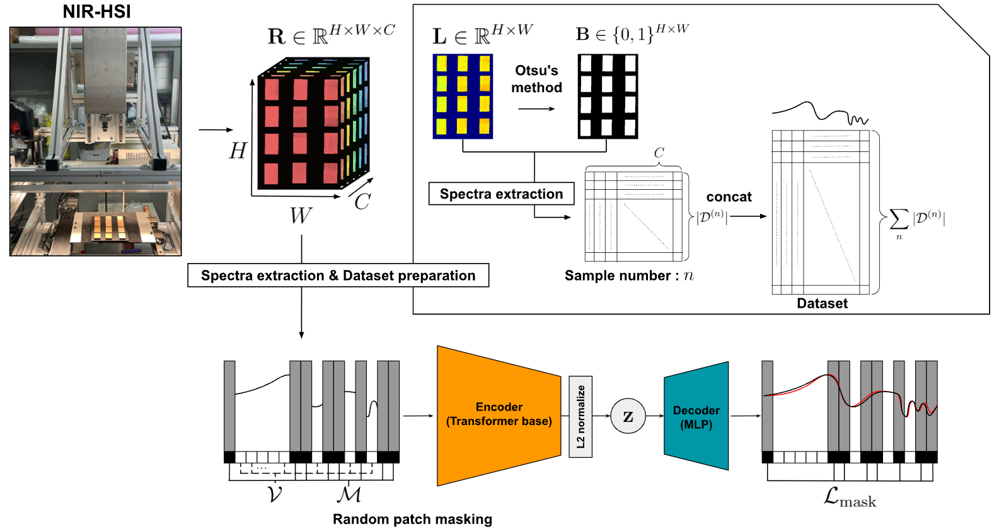
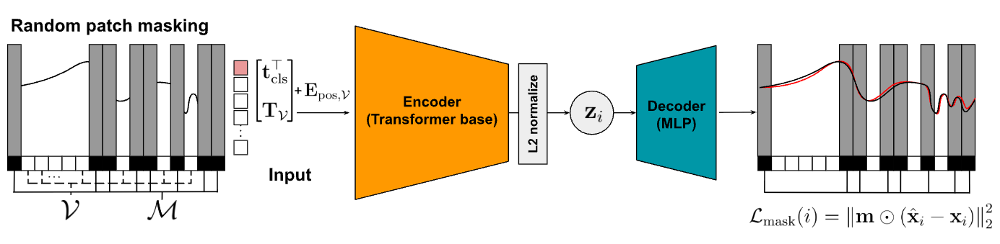
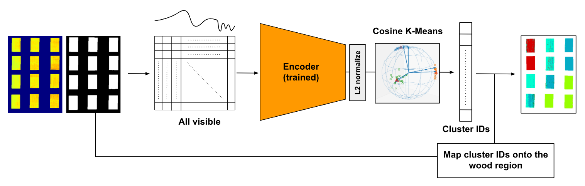

## 日本木材学会大会（2026、広島）ポスター発表 補足資料

本ページでは、[学会ポスター](https://github.com/Mantis-Ryuji/poster-2026/blob/main/木材学会ポスター2026.pdf)で紹介した内容のうち、**主に解析フロー** の詳細を補足します。
ポスター本体では紙面の都合上、省略した数式・再現手順等も含めて整理しています。

また、本ページで紹介するモデルは **PyPI で公開済み** のため、手元の Python 環境でそのまま利用できます。ただし、学習・推論にはGPU の利用を推奨します。GPU 環境が手元にない場合は、Google Colab などのクラウド実行環境を利用してください。

[](https://pypi.org/project/chemomae/) [](https://pypi.org/project/chemomae/) []()

- **GitHub（実装）** : https://github.com/Mantis-Ryuji/ChemoMAE

```bash
pip install chemomae
```

---

## 概要

本手法は、近赤外 (NIR) や可視光等の 1次元スペクトルを対象とした、Masked Autoencoder (MAE) に基づく自己教師あり表現学習である。スペクトルをパッチ単位で部分的にマスクし、欠損情報を含む系列全体を再構成する学習タスクを課すことで、化学組成や物理状態の変遷を内包した潜在表現を獲得する。ラベルを必要としないため、劣化のようなアノテーションコストが困難な現象の特徴抽出に適している。

マスキングと再構成により、モデルは特定波長の局所的な振幅情報への過度な依存を抑制され、スペクトル全体の文脈および波長間の相関構造を学習するよう誘導される。これにより、測定ノイズや局所的ばらつきに由来する非本質的な変動が相対的に棄却され、物理化学的な本質を捉えたロバストな潜在表現が得られる。

さらに、学習される潜在表現は L2 正規化により単位超球面上に拘束する設計である。これは SNV と幾何学的な整合性を確保するためであり、ノルム成分を排除して方向成分（コサイン類似度）へ情報を集約する。 

本手法は単なる次元圧縮に留まらず、様々な下流タスクへ展開するための基盤表現学習として位置づけられる。

<p align="center">

</p>

<details><summary><b>記号の定義（クリックで展開）</b></summary>

* $H$ : 画像の高さ（ピクセル数）
* $W$ : 画像の幅（ピクセル数）
* $C$ : スペクトルバンド数（波長点数）
* $N$ : サンプル総数
* $\mathbf{I}\in\mathbb{R}^{H\times W\times C}$ : 観測強度（intensity）
* $\mathbf{W}_{\rm ref}\in\mathbb{R}^{1\times W\times C}$ : 白板参照の観測強度
* $\mathbf{D}_{\rm ref}\in\mathbb{R}^{1\times W\times C}$ : 暗電流参照の観測強度
* $\mathbf{R}\in\mathbb{R}^{H\times W\times C}$ : 反射率画像（reflectance）
* $\mathbf{r}_{h,w}\in\mathbb{R}^{C}$ : 画素 $(h,w)$ の反射率スペクトル（ $\mathbf{R}$ のスペクトル軸方向ベクトル）
* $\mathbf{L}\in\mathbb{R}^{H\times W}$ : $\ell_2$ ノルム画像（成分が $l_{h,w}\in\mathbb{R}_{\ge 0}$）
* $\mathbf{B}\in{0,1}^{H\times W}$ : 二値マスク（1: 木材領域，0: 背景）
* $\mathbf{X}^{(n)}_{\rm refl}$ : サンプル $n$ の木材領域から抽出した反射率スペクトル行列（列数 $C$ ）
* $\mathbf{X}_{\rm refl}$ : 全サンプルを縦連結した反射率スペクトル行列
* $\mathbf{X}$ : $\mathbf{X}_{\rm refl}$ に SNV を適用したデータセット行列
* $\tilde{\mathbf{x}}_i\in\mathbb{R}^{C}$ : $\mathbf{X}_{\rm refl}$ の第 $i$ 行ベクトル（SNV 前）
* $\mathbf{x}_i\in\mathbb{R}^{C}$ : SNV 後ベクトル
* $d_{\rm model} $: Transformer の埋め込み次元
* $\mathbf{z}_i\in\mathbb{S}^{d_z-1}$: 潜在表現
* $d_z$ : 潜在表現の次元
* $\mathcal{V}\subseteq\{1,\ldots,P\}$ : 可視パッチ集合
* $\mathcal{M}\subseteq\{1,\ldots,P\}$ : マスクパッチ集合 $\left(\mathcal{M}=\{1,\ldots,P\}\setminus\mathcal{V}\right)$
* $\theta$ : Encoder の学習パラメータ
* $\phi$ : Decoderの学習パラメータ

</details>

---

### データ前処理とデータセット作成

#### 1. 反射率変換

NIR-HSI から得られた試料の観測強度 $\mathbf{I}$ を、白板参照 $\mathbf{W}_{\rm ref}$ および 暗電流参照 $\mathbf{D}_{\rm ref}$ を用いて反射率 $\mathbf{R}$ に変換する：

```math
\mathbf{R}
=
\frac{\mathbf{I}-\mathbf{D}_{\rm ref}}{\mathbf{W}_{\rm ref}-\mathbf{D}_{\rm ref}}
```

$\mathbf{I}$ との演算は要素ごとに行い、必要に応じて $\mathbf{W}_{\rm ref},\mathbf{D}_{\rm ref}$ を高さ方向 $H$ にブロードキャストして用いる。

#### 2. ノルム画像の作成

画素 $(h, w)$ における反射率スペクトル $\mathbf{r}_{h, w}$ を、$\mathbf{R}$ のスペクトル軸方向のベクトルとして定義する：

```math
\mathbf{r}_{h, w}
=
\left[r_{h, w,1}, r_{h, w,2}, \ldots, r_{h, w,C}\right]^\top
\in\mathbb{R}^{C}
```

次に、各画素スペクトルの $\ell_2$ ノルムからノルム画像 $\mathbf{L}$ を構成する：

```math
l_{h, w}
=
\|\mathbf{r}_{h, w}\|_2
=
\sqrt{\mathbf{r}_{h, w}^\top\mathbf{r}_{h, w}}
```

#### 3. 大津の二値化による木材領域マスクの作成

ノルム値 $l_{h, w}$ を 2 クラス（背景 / 木材）に分割する閾値 $t^*$ を、大津の二値化により求める。
閾値 $t$ に対して、画素集合を次の 2 クラスに分割する：

```math
\mathcal{C}_0(t)=\{(h, w)\mid l_{h, w}\le t\},\qquad
\mathcal{C}_1(t)=\{(h, w)\mid l_{h, w}> t\}
```

各クラスの画素数を

```math
n_k(t)=|\mathcal{C}_k(t)|\quad (k\in\{0,1\}),\qquad
HW = n_0(t)+n_1(t)
```

とし、各クラス平均および全体平均をそれぞれ

```math
\mu_k(t)=\frac{1}{n_k(t)}\sum_{(h, w)\in\mathcal{C}_k(t)} l_{h, w}\quad (k\in\{0,1\}),
```

```math
\mu=\frac{1}{HW}\sum_{h=1}^{H}\sum_{w=1}^{W} l_{h, w}
```

で定義する。大津の二値化はクラス間分散

```math
\sigma_B^2(t)
=
\frac{n_0(t)}{HW}\frac{n_1(t)}{HW}\left(\mu_0(t)-\mu_1(t)\right)^2
```

を最大化する閾値 $t^*$ を選択する：

```math
t^*=\arg\max_t  \sigma_B^2(t)
```

最後に、二値マスク $\mathbf{B}$ を

```math
b_{h, w}=
\begin{cases}
1 & (l_{h, w}>t^*)\\
0 & (l_{h, w}\le t^*)
\end{cases}
```

として定義する（$1$ を木材領域、$0$ を背景とする）。

（実務上は $\mathbf{I}$ のノルム画像に対して二値化する方が安定します。）

#### 4. データセット作成

サンプル $n\in{1,\dots,N}$ に対して、二値マスク $\mathbf{B}^{(n)}$ により木材領域の画素集合

```math
\mathcal{D}^{(n)}=\{(h,w)\mid b^{(n)}_{h,w}=1\}
```

を定義する。木材領域から反射率スペクトルを抽出して行方向に積み上げた行列を

```math
\mathbf{X}^{(n)}_{\rm refl}
=
\begin{bmatrix}
(\mathbf{r}^{(n)}_{h_1,w_1})^\top\\
(\mathbf{r}^{(n)}_{h_2,w_2})^\top\\
\vdots\\
(\mathbf{r}^{(n)}_{h_{|\mathcal{D}^{(n)}|},w_{|\mathcal{D}^{(n)}|}})^\top
\end{bmatrix}
\in\mathbb{R}^{|\mathcal{D}^{(n)}|\times C},
\qquad
\left((h_m,w_m)\in\mathcal{D}^{(n)}\right)
```

と定義する。

次に、全サンプルについて縦方向に連結することで、反射率スペクトルからなるデータセット行列 $\mathbf{X}_{\rm refl}$ を得る：

```math
\mathbf{X}_{\rm refl}
=
\begin{bmatrix}
\mathbf{X}^{(1)}_{\rm refl}\\
\mathbf{X}^{(2)}_{\rm refl}\\
\vdots\\
\mathbf{X}^{(N)}_{\rm refl}
\end{bmatrix}
\in\mathbb{R}^{\sum_{n=1}^{N}|\mathcal{D}^{(n)}|\times C}
```

最後に、$\mathbf{X}_{\rm refl}$ の各行ベクトルに対して SNV（Standard Normal Variate）処理を適用し、データセット行列 $\mathbf{X}$ を得る。
ここで、$\mathbf{X}_{\rm refl}$ の第 $i$ 行ベクトルを $\tilde{\mathbf{x}}_i^\top$ と書き、

```math
\mathbf{X}_{\rm refl}
=
\begin{bmatrix}
\tilde{\mathbf{x}}_1^\top\\
\tilde{\mathbf{x}}_2^\top\\
\vdots\\
\tilde{\mathbf{x}}_{\sum_{n=1}^{N}|\mathcal{D}^{(n)}|}^\top
\end{bmatrix},
\qquad
\tilde{\mathbf{x}}_i\in\mathbb{R}^{C}
\quad (i=1,\ldots, \sum_{n=1}^{N}|\mathcal{D}^{(n)}|)
```

とする。各 $\tilde{\mathbf{x}}_i$ に対して平均と標準偏差を

```math
\tilde{\mu}_i=\frac{1}{C}\sum_{c=1}^{C} \tilde{x}_{i,c},\qquad
\tilde{\sigma}_i=\sqrt{\frac{1}{C-1}\sum_{c=1}^{C}\left(\tilde{x}_{i,c}-\tilde{\mu}_i\right)^2}
```

と定義し、SNV 後のベクトル $\mathbf{x}_i\in\mathbb{R}^{C}$ を

```math
\mathbf{x}_i
=
\frac{\tilde{\mathbf{x}}_i-\tilde{\mu}_i\mathbf{1}}{\tilde{\sigma}_i}
\in\mathbb{R}^{C},
\qquad
(\mathbf{1}\in\mathbb{R}^{C}:\text{全要素が1のベクトル})
```

で与える。この $\mathbf{x}_i$ を行として並べた行列を $\mathbf{X}$ とする：

```math
\mathbf{X}
=
\begin{bmatrix}
\mathbf{x}_1^\top\\
\mathbf{x}_2^\top\\
\vdots\\
\mathbf{x}_{\sum_{n=1}^{N}|\mathcal{D}^{(n)}|}^\top
\end{bmatrix}
\in\mathbb{R}^{\sum_{n=1}^{N}|\mathcal{D}^{(n)}|\times C}
```

---

### SNV処理の特性

SNV 処理は、各スペクトル $\tilde{\mathbf{x}}_i\in\mathbb{R}^C$ に対して平均 $\tilde{\mu}_i$ と標準偏差 $\tilde{\sigma}_i$ を

```math
\tilde{\mu}_i=\frac{1}{C}\sum_{c=1}^{C} \tilde{x}_{i,c},\qquad
\tilde{\sigma}_i=\sqrt{\frac{1}{C-1}\sum_{c=1}^{C}\left(\tilde{x}_{i,c}-\tilde{\mu}_i\right)^2}
```

で定義し、SNV 後のベクトル $\mathbf{x}_i\in\mathbb{R}^C$ を

```math
\mathbf{x}_i
=
\frac{\tilde{\mathbf{x}}_i-\tilde{\mu}_i\mathbf{1}}{\tilde{\sigma}_i}
\qquad
(\mathbf{1}\in\mathbb{R}^{C}:\text{全要素が1のベクトル})
```

で与える。
まず、

```math
\tilde{\sigma}_i=\sqrt{\frac{1}{C-1}\sum_{c=1}^{C}\left(\tilde{x}_{i,c}-\tilde{\mu}_i\right)^2}
```

の両辺を二乗すると、

```math
\tilde{\sigma}_i^2
=
\frac{1}{C-1}\sum_{c=1}^{C}\left(\tilde{x}_{i,c}-\tilde{\mu}_i\right)^2
```

したがって両辺に $(C-1)$ を掛けて、

```math
\sum_{c=1}^{C}\left(\tilde{x}_{i,c}-\tilde{\mu}_i\right)^2
=
(C-1)\tilde{\sigma}_i^2
```

ここで、$\tilde{\sigma}_i>0$ を仮定して（SNV が定義可能であるため）、両辺を $\tilde{\sigma}_i^2$ で割ると、

```math
\sum_{c=1}^{C}\left(\frac{\tilde{x}_{i,c}-\tilde{\mu}_i}{\tilde{\sigma}_i}\right)^2
=
C-1
\qquad \cdots \textcircled{\scriptsize1}
```

次に、$\mathbf{x}_i$ の各成分は

```math
x_{i,c}=\frac{\tilde{x}_{i,c}-\tilde{\mu}_i}{\tilde{\sigma}_i}
```

であるから、$\mathbf{x}_i$ の $\ell_2$ ノルムは

```math
\|\mathbf{x}_i\|_2
=
\sqrt{\sum_{c=1}^{C}x_{i,c}^2}
=
\sqrt{\sum_{c=1}^{C}\left(\frac{\tilde{x}_{i,c}-\tilde{\mu}_i}{\tilde{\sigma}_i}\right)^2}
```

よって、$\textcircled{\scriptsize1}$ を用いて

```math
\boxed{\|\mathbf{x}_i\|_2=\sqrt{C-1}}
```

SNV処理により各スペクトル $\mathbf{x}_i$ の $\ell_2$ ノルムは $\sqrt{C-1}$ に正規化される。したがって、全データは半径 $\sqrt{C-1}$ の超球面

```math
\{\mathbf{x}\in\mathbb{R}^C \mid \|\mathbf{x}\|_2=\sqrt{C-1}\}
=
\sqrt{C-1} \mathbb{S}^{C-1}
```

上に配置される。

本研究ではこの球面構造を尊重し、 **球面幾何** に整合した解析フローを構築した。

---

### Masked Autoencoder

近年のディープラーニングにおける主要な潮流の一つに、ラベルのない膨大なデータから本質的な特徴を抽出する「自己教師あり学習（Self-Supervised Learning）」がある。その中でも、データの一部を意図的に隠蔽し、残された情報から欠損部を再構成させる Masked Autoencoder（MAE）の手法は、多様なドメインにおいて画期的な成果を収めてきた。このアプローチの原点は自然言語処理における **BERT** に遡る。BERTは文中のトークンの一部をマスクし、その位置に入るべき語彙を周辺文脈から推定するように学習を行う。ここで重要なのは、入力列の中で「どこが隠されたか」が明示的に示される点にある。モデルは、マスク位置の識別子と周辺文脈を同時に参照することでトークン間の高度な依存関係を学習し、結果として多様な下流タスクに転用可能な汎用的表現を獲得する。

こうした「隠して当てる」という枠組みは、画像領域へと拡張され、**ViT-MAE** として独自の洗練を遂げた。画像をパッチ列として扱いその大部分を遮蔽する点は BERT と共通するが、その計算設計は大きく異なる。最大の特徴は、マスクされたパッチをエンコーダに入力せず、可視パッチのみを処理対象とする「非対称型エンコーダ・デコーダ構造」の採用である。これにより、画像のように冗長性の高いデータにおいて極めて高いマスク率（例：75%以上）を設定しても、エンコーダの計算コストを劇的に削減しつつ、効率的かつ頑健な再構成学習を実現している。欠損位置の情報はエンコーダ段階では「未入力」として暗黙的に規定され、後のデコーダ段階で初めて位置情報とともに統合される設計となっている。

そして現在、これら一連の系譜は、波長軸に沿った一次元信号である **スペクトルデータ** の解析においても極めて有力なパラダイムとなりつつある。スペクトルには、特定の官能基に由来する局所的な吸収帯から、散乱などに起因する広帯域なベースライン変動まで、複数のスケールにわたる物理的・化学的構造が重畳している。MAEを用いて波長帯域の一部を遮蔽しその復元をモデルに課せば、モデルは帯域間の相関や物理的な連続性、あるいは形状の微細な差分といった本質的な特徴を捉える必要が生じる。特に、装置差や散乱、濃度変動といった外乱が混在する実データにおいては、復元プロセスを通じて「物理的に本質的な情報」と「局所的なノイズ」を分離する学習圧力が働き、結果として従来の手法よりも強靭な潜在表現の獲得が期待される。

スペクトル解析における MAE の優位性は、大きく三つの側面に集約される。第一に、教師なしで膨大な未ラベルデータから表現を学習できるため、化学分析値などのアノテーションが高価な課題において、下流性能を大幅に底上げできる点である。第二に、獲得された潜在表現は、回帰分析のみならずクラスタリングや異常検知、あるいは現象の進行度を捉える連続的な指標推定など、多様な分析目的に柔軟に展開できる点である。第三に、復元誤差という客観的な指標が存在するため、前処理の手法やモデル構造が表現能力に与える影響を定量的に比較でき、実験設計を体系化しやすい点である。総じて、MAEはスペクトル解析における「ラベル不足」と「外乱の複雑性」という二大障壁を同時に解消し得る、次世代の解析プラットフォームとしての可能性を秘めている。

<p align="center">

</p>

#### 1. パッチ化＋トークン化

スペクトル $\mathbf{x}_i\in\mathbb{R}^{C}$ をパッチ数 $P$ で分割し、パッチサイズを

```math
p := \frac{C}{P} \quad (\text{割り切れる前提})
```

とする。パッチ行列を

```math
\mathbf{X}^{\rm patch}_i \in \mathbb{R}^{P \times p}
```

と定義する。
トークン化（線形写像）：

```math
\mathbf{T}_i = \mathbf{X}^{\rm patch}_i \mathbf{W}_e + \mathbf{1} \mathbf{b}_e^\top
\in \mathbb{R}^{P \times d_{\rm model}},
\quad
\mathbf{W}_e\in\mathbb{R}^{p \times d_{\rm model}},
\mathbf{b}_e\in\mathbb{R}^{d_{\rm model}}
```

#### 2. 位置埋め込み

CLS トークンを $\mathbf{t}_{\rm cls}\in\mathbb{R}^{d_{\rm model}}$ とし、フル系列（CLS + 全パッチ）を
```math
\mathbf{S}^{\rm full}_i
=
\begin{bmatrix}
\mathbf{t}_{\rm cls}^\top\\
\mathbf{T}_i
\end{bmatrix}
\in\mathbb{R}^{(P+1)\times d_{\rm model}}
```
とする。位置埋め込みは同じ形で

```math
\mathbf{E}_{\rm pos}\in\mathbb{R}^{(P+1)\times d_{\rm model}}
```

を用意し、

```math
\mathbf{S}^{\rm full}_i \leftarrow \mathbf{S}^{\rm full}_i + \mathbf{E}_{\rm pos}
```

CLS+全トークンに位置埋め込みを加算する。

#### 3. 可視部分の抽出

可視インデックス集合を $\mathcal{V}$ を用いて可視トークンを

```math
\mathbf{T}_{\mathcal{V}} := \mathbf{T}_i[\mathcal{V}] \in\mathbb{R}^{|\mathcal{V}|\times d_{\rm model}}
```

と定義する。（行の gather）
このとき、位置埋め込みも同じ行を gather して

```math
\mathbf{E}_{\rm pos,\mathcal{V}} := \mathbf{E}_{\rm pos}\left[\{0\}\cup \mathcal{V}\right]
\in\mathbb{R}^{(|\mathcal{V}|+1)\times d_{\rm model}}, \qquad
\text{\{0\} は CLS 行のインデックス}
```

よって、エンコーダ入力は

```math
\boxed{
\mathbf{S}^{\rm enc}_i
=
\begin{bmatrix}
\mathbf{t}_{\rm cls}^\top\\
\mathbf{T}_{\mathcal{V}}
\end{bmatrix}
+
\mathbf{E}_{\rm pos,\mathcal{V}}
\in\mathbb{R}^{(|\mathcal{V}|+1)\times d_{\rm model}}
}
```

#### 4. Encoder

入力 $\mathbf{S}^{\rm enc}_i$ に対し、$L$ 層の Transformer Encoder (`nn.TransformerEncoderLayer`) を適用して隠れ状態列を得る：

```math
\mathbf{H}_i
=
{\rm Enc}_{\theta}\!\left(\mathbf{S}^{\rm enc}_i\right)
\in\mathbb{R}^{(|\mathcal{V}|+1)\times d_{\rm model}}
```

ここで ${\rm Enc}_{\theta}$ は、同一形状を保つ Self-Attention + FFN ブロックの合成（ $L$ 層）である。
CLS 出力（先頭トークン）を

```math
\mathbf{h}_{{\rm cls},i}
:=
\mathbf{H}_i^{(L)}[0]
\in\mathbb{R}^{d_{\rm model}}
```

と定義する。

##### TransformerEncoderLayer（`nn.TransformerEncoderLayer`）

各層 $\ell=1,\ldots,L$ は

* Multi-Head Self-Attention（MHSA）
* Position-wise FFN
* 残差接続（Residual）
* LayerNorm

から構成され、入力と同じ形状の出力を返す：

```math
\mathbf{H}_i^{(\ell)}
=
{\rm TransformerEncoderLayer}^{(\ell)}\!\left(\mathbf{H}_i^{(\ell-1)}\right),
\qquad
\mathbf{H}_i^{(0)}=\mathbf{S}^{\rm enc}_i
```

最終的に $\mathbf{H}_i^{(L)}$ を得る。

##### Projection head

CLS 表現 $\mathbf{h}_{{\rm cls},i}$ を潜在表現 $\mathbf{z}_i\in\mathbb{R}^{d_z}$ に線形射影する：

```math
\bar{\mathbf{z}_i}
=
\mathbf{W}_{\rm proj}\mathbf{h}_{{\rm cls},i}+\mathbf{b}_{\rm proj}
\in\mathbb{R}^{d_z},
\quad
\mathbf{W}_{\rm proj}\in\mathbb{R}^{d_z\times d_{\rm model}},
\mathbf{b}_{\rm proj}\in\mathbb{R}^{d_z}
```

SNV後のスペクトルと幾何的整合性をとるために、最終的に $\ell_2$ 正規化を付ける：

```math
\mathbf{z}_i
=
\frac{\bar{\mathbf{z}_i}}{\|\bar{\mathbf{z}_i}\|_2}
\in\mathbb{S}^{d_z-1}
```

#### 5. Decoder

Encoder で得た潜在表現 $\mathbf{z}_i\in\mathbb{S}^{d_z-1}$ から、元のスペクトル $\mathbf{x}_i\in\mathbb{R}^C$ を再構成するデコーダ ${\rm Dec}_{\phi}$ を定義する。
本研究ではデコーダを MLP とし、 $\mathbf{z}_i$ を直接 $C$ 次元へ写像して再構成スペクトル $\hat{\mathbf{x}}_i$ を得る：

```math
\hat{\mathbf{x}}_i
=
{\rm Dec}_{\phi}(\mathbf{z}_i)
\in\mathbb{R}^{C}
```

#### 6. Loss Function

##### パッチ集合 $\mathcal{M}$ からマスク支持子 $\mathbf{m}\in\{0,1\}^C$ を作成

パッチ $j\in{1,\ldots,P}$ が覆う波長点インデックス集合を

```math
\mathcal{I}(j)
:=
\{(j-1)p+1,(j-1)p+2\ldots, jp\}
```

と定義する。
マスクされた波長点集合は $\bigcup_{j\in\mathcal{M}} \mathcal{I}(j)$ であるから、
波長点レベルのマスク指示子 $\mathbf{m}\in{0,1}^{C}$ を

```math
m_c
=
\begin{cases}
1 & \left(c\in \bigcup_{j\in\mathcal{M}} \mathcal{I}(j)\right)\\
0 & \left(c\notin \bigcup_{j\in\mathcal{M}} \mathcal{I}(j)\right)
\end{cases}
\qquad (c=1,\ldots,C)
```

> $\mathbf{m}$ はマスクされたパッチに属する成分だけ 1 になるベクトル

##### 損失関数（マスク領域でのみ計算）

元スペクトル $\mathbf{x}_i\in\mathbb{R}^C$ 、再構成 $\hat{\mathbf{x}}_i\in\mathbb{R}^C$ に対し、アダマール積 $\odot$ を用いて

```math
\boxed{
\mathcal{L}_{\rm mask}(i)
=
\left\|\mathbf{m}\odot(\hat{\mathbf{x}}_i-\mathbf{x}_i)\right\|_2^2
}
```

---

## 教師なしセグメンテーション

MAE により得られた潜在表現を Cosine K-Means でクラスタリングし、各スペクトル（画素）にクラスタ ID を割り当てる。次に、あらかじめ作成した木材領域の二値マスクを用いて、木材領域にのみクラスタ ID を埋め戻すことでラベル画像を再構成する。具体的には、マスクで抽出した木材画素の1次元配列にクラスタ ID を対応付け、背景画素には無効値 -1 を付与したうえで、元の画像サイズ (H, W) に戻してラベルマップを得る。

<p align="center">

</p>

### Cosine K-Means

$\mathbf{X}\in\mathbb{R}^{\sum_{n=1}^{N}|\mathcal{D}^{(n)}|\times C}$ を **全可視** で学習済み Encoder に入力して得た特徴量行列を、
$\mathbf{Z}\in\mathbb{R}^{\sum_{n=1}^{N}|\mathcal{D}^{(n)}|\times d_z}$ とする。

$\mathbf{Z}$

---

## 付録

<details><summary><b>教師なしセグメンテーション結果一覧（クリックで展開）</b></summary>


</details>